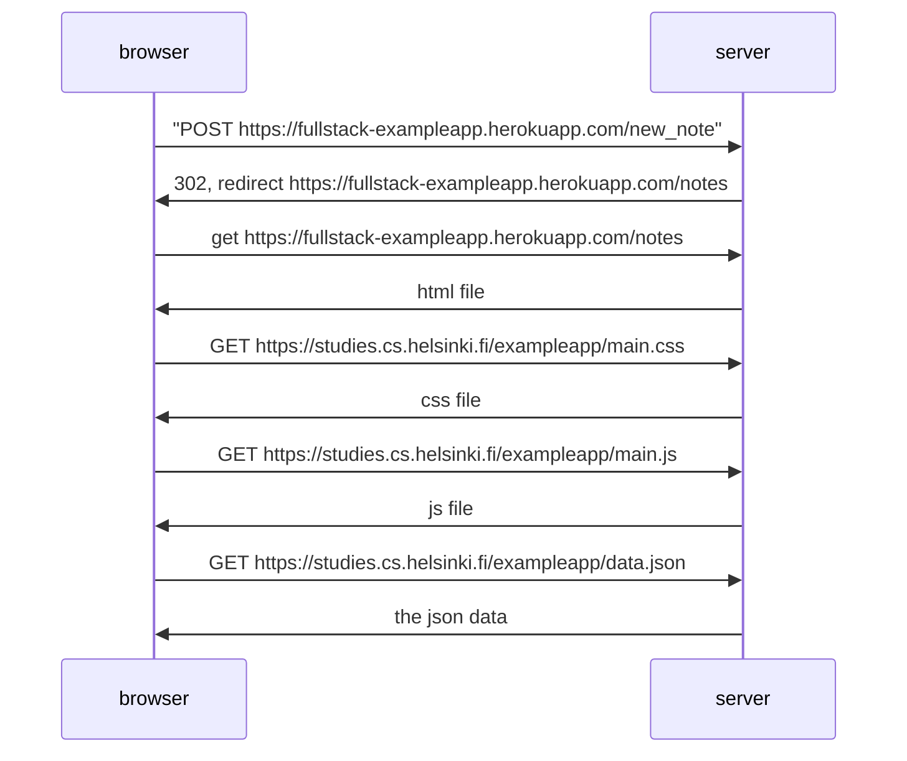

```mermaid
sequenceDiagram
participant browser
participant server

browser->>server: "POST https://fullstack-exampleapp.herokuapp.com/new_note"
server ->> browser: 302, redirect https://fullstack-exampleapp.herokuapp.com/notes

browser ->> server: get https://fullstack-exampleapp.herokuapp.com/notes
server ->> browser: html file

browser->>server: GET https://studies.cs.helsinki.fi/exampleapp/main.css
server ->> browser: css file

browser->>server: GET https://studies.cs.helsinki.fi/exampleapp/main.js
server ->> browser: js file

browser->>server: GET https://studies.cs.helsinki.fi/exampleapp/data.json
server ->> browser: the json data


```
